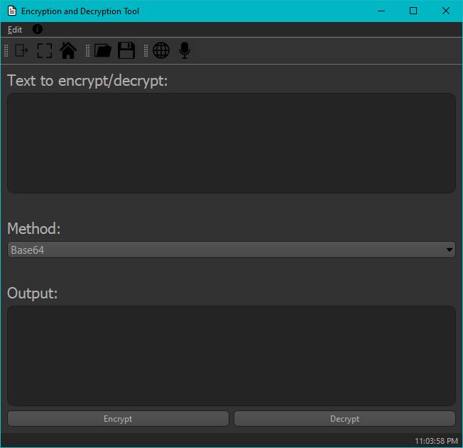

# Text Encoder and Decoder

### Encode and decode text in many different ways using this GUI application!

#### Encode in:
- ASCII85
- Base85
- Base64
- Base32
- Base16
- Url
- MD5 Hash
- SHA-1
- SHA-256
- SHA-512

#### Decode in:
- ASCII85
- Base85
- Base64
- Base32
- Base16
- Url

#### [See the app's license as well](https://github.com/nonimportant/text-encode-and-decoder/blob/main/LICENSE)

###### Made with Python 3.9.6 and PyQt5 5.15.4
